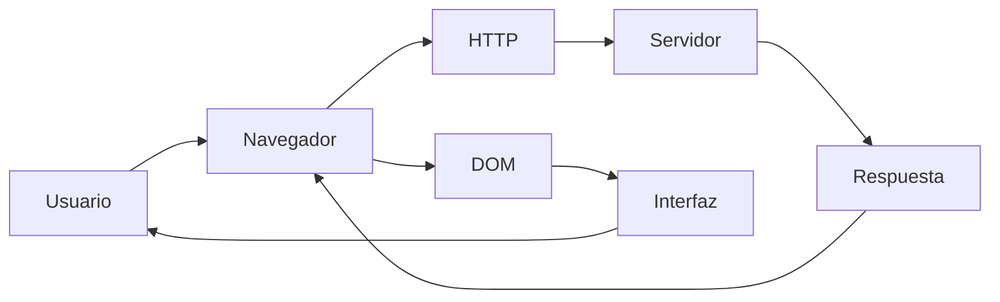
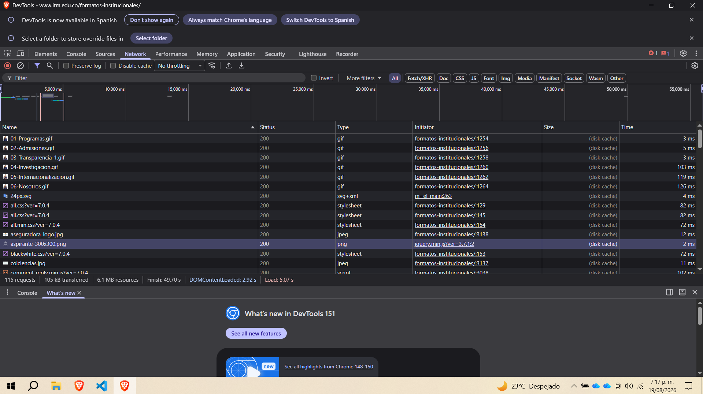
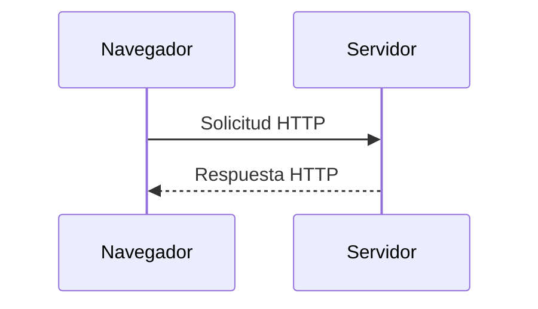
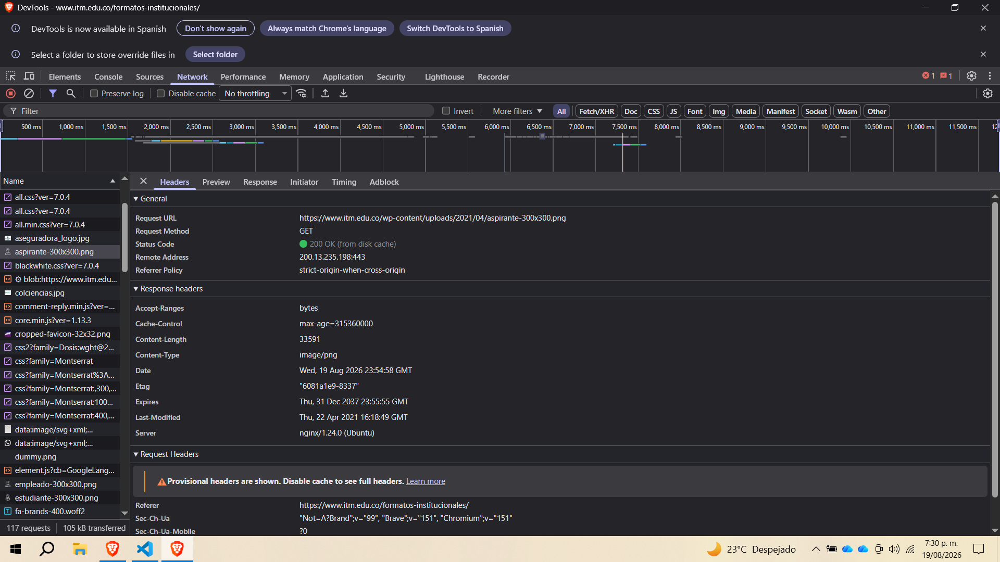
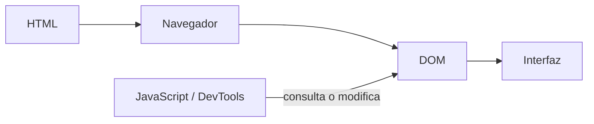
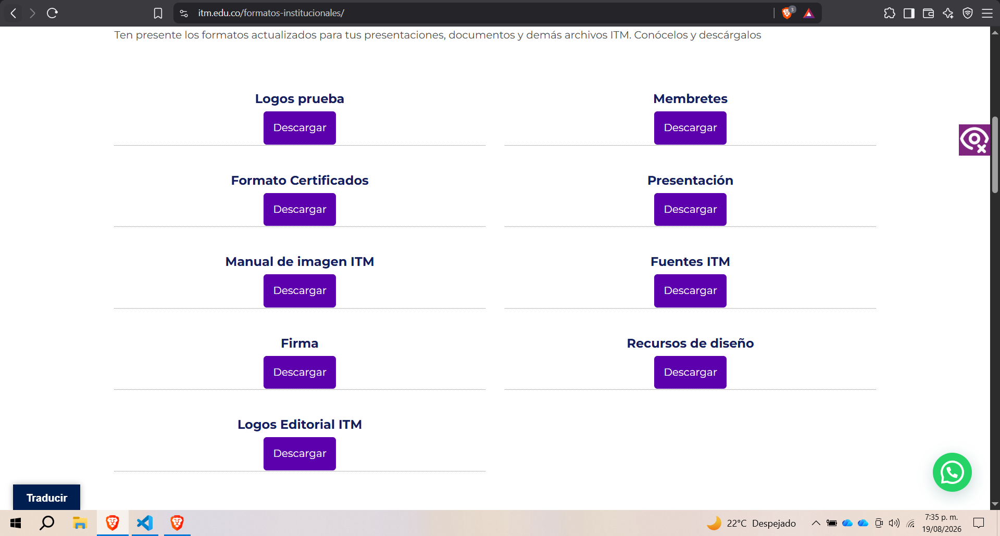
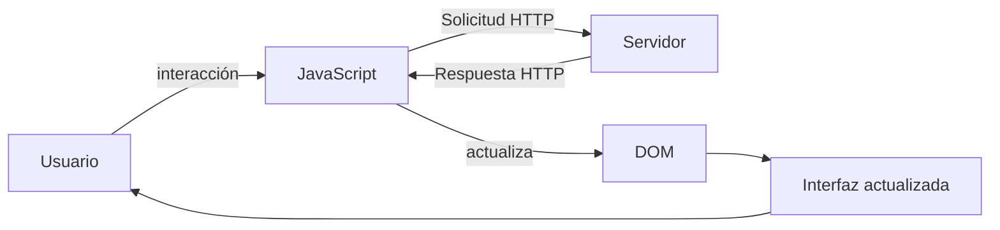
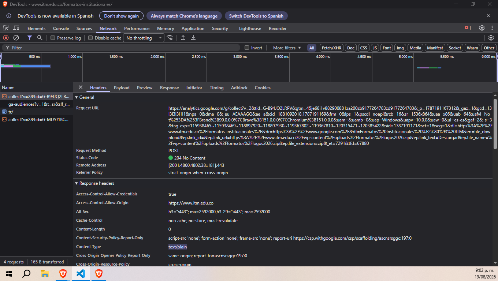
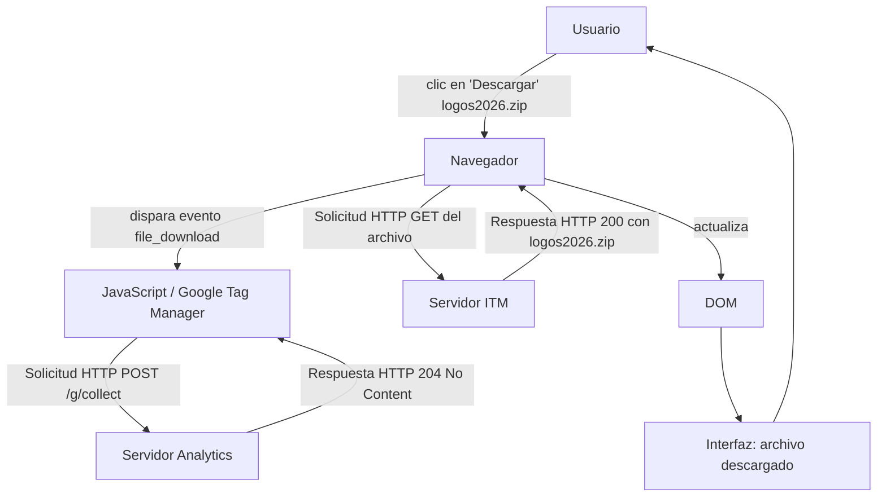

# Laboratorio 01 --- Análisis del funcionamiento de una aplicación web

> **Curso:** Aplicaciones y Servicios Web\
> **Modalidad:** Práctica de laboratorio\
> **Entrega:** Repositorio GitHub --- archivo `README.md`\
> **Evidencias:** Carpeta `evidencias/`

------------------------------------------------------------------------

## Objetivo de la práctica

Analizar el funcionamiento de una aplicación web real mediante las
herramientas de desarrollo del navegador, identificando los recursos
cargados, las solicitudes y respuestas HTTP, la estructura DOM y las
interacciones entre cliente y servidor.

## Resultado esperado

Al finalizar la práctica, el estudiante deberá poder reconstruir y
documentar el flujo observado entre:



> El diagrama anterior representa los **componentes que serán
> analizados**. El diagrama final de la práctica deberá ser construido
> por el estudiante a partir de sus propias observaciones.

------------------------------------------------------------------------

# 1. Preparación del entorno

1.  Ingrese a la aplicación web indicada por el docente.
2.  Abra las **herramientas de desarrollo** del navegador.
3.  Identifique las herramientas **Red / Network** y **Elementos /
    Elements**.
4.  Cree la siguiente estructura dentro del repositorio:

``` text
laboratorio-01/
├── README.md
└── evidencias/
```

El archivo `README.md` será el informe de la práctica. La carpeta
`evidencias/` contendrá las capturas utilizadas para sustentar los
resultados.

------------------------------------------------------------------------

# 2. Identificación de recursos de la aplicación

Abra la herramienta **Red / Network** y recargue completamente la
aplicación.

Observe las solicitudes generadas durante la carga e identifique como
mínimo **cinco recursos**, procurando seleccionar tipos diferentes:
documento HTML, CSS, JavaScript, imágenes, fuentes u otros.

## Resultados

Complete la tabla:

  Recurso   Tipo   Dominio     Tamaño
  --------- ------ --------- --------
  https://www.itm.edu.co/formatos-institucionales/  document  https://www.itm.edu.co/     93.5 KB
  
  https://www.googletagmanager.com/gtm.js?id=GTM-T3PQ5L7 script  https://www.itm.edu.co/   3.7 KB

  https://www.itm.edu.co//wp-content/uploads/2021/09/05-Internacionalizacion.gif  image/gif  https://www.itm.edu.co/  DISK CACHE

  https://use.fontawesome.com/releases/v6.7.2/css/all.css?ver=7.0.4  stylesheet  https://www.itm.edu.co/ DISK CACHE

  https://www.itm.edu.co/wp-content/uploads/2021/04/aspirante-300x300.png PNG  https://www.itm.edu.co/ DISK CACHE                         
                             

**Total de solicitudes observadas:** `5`

## Evidencia

Guarde una captura de la pestaña Network como:

``` text
evidencias/network.png
```

Inclúyala aquí:



### Análisis

**¿Por qué una sola URL puede generar múltiples solicitudes HTTP?**

> cuando el navegador solicita una url realmente solo muestra el html principal como primer respuesta ese html actua como un mapa que referencia otros recursos necesarios para renderizar la pagina completa, como archivos de css, imagenes, javascript, etc.

------------------------------------------------------------------------

# 3. Análisis de una solicitud HTTP

En **Network**, seleccione una de las solicitudes realizadas por el
navegador, preferiblemente la correspondiente al documento principal.

Identifique la información solicitada a continuación.

  Elemento              Resultado
  --------------------- -----------
  URL                   https://www.itm.edu.co/wp-content/uploads/2021/04/aspirante-300x300.png     
  Método HTTP           GET
  Código de estado      200
  Host / dominio        https://www.itm.edu.co/formatos-institucionales/
  Tipo de recurso       image/png
  Tiempo de respuesta   3.31 MS

## Flujo que se está observando



## Evidencia

Guarde una captura de los detalles de la solicitud como:

``` text
evidencias/request.png
```

Inclúyala en el informe:



### Análisis

**¿Qué recurso solicitó el navegador?**

> solicito el recurso de una imagen

**¿Qué información permite determinar si la solicitud fue atendida
correctamente?**

> el codigo de estado, pues cuando es 200 quiere decir que fue exitoso

------------------------------------------------------------------------

# 4. Inspección del DOM

Seleccione un elemento visible de la aplicación, por ejemplo:

-   un botón;
-   un título;
-   un enlace;
-   un campo de formulario;
-   un elemento del menú.

Utilizando **Elementos / Elements**:

1.  Localice el elemento dentro del DOM.
2.  Identifique la etiqueta HTML utilizada.
3.  Modifique temporalmente su contenido desde las herramientas de
    desarrollo.
4.  Observe el cambio producido en la interfaz.
5.  Registre la evidencia.

## Resultados

**Elemento seleccionado:** `titulo con etiqueta h3 llamado Logos ITM`

**Etiqueta HTML:** `h3`

**Contenido original:** `Logos ITM`

**Modificación realizada:** `Logos prueba`

El proceso observado puede representarse conceptualmente así:



## Evidencia

Guarde la captura como:

``` text
evidencias/dom.png
```

Inclúyala aquí:



### Análisis

**¿La modificación realizada sobre el DOM alteró permanentemente la
aplicación o los archivos almacenados en el servidor? Justifique.**

> La modificación que se hizo no modifico permanente la aplicacion ni los archivos almacenados, por que solo esta renderizando el html en el navegador de mi equipo, entonces al yo modificarlo desde la opcion de inspeccionar elemento realmente no afecta la aplicacion ni a los demas usuarios que la utilizan, es solo temporal y solo se puede visualizar en mi equipo la modificacion

------------------------------------------------------------------------

# 5. Análisis de una interacción dinámica

Regrese a **Network** y limpie las solicitudes registradas.

Realice una acción dentro de la aplicación que pueda generar una
interacción con el servidor, por ejemplo:

-   consultar;
-   buscar;
-   filtrar;
-   seleccionar una opción;
-   enviar información.

Observe si aparece una nueva solicitud en Network.

## Resultados

  Elemento                       Resultado
  ------------------------------ -----------
  Acción realizada               Descargar los logos del ITM
  ¿Generó una nueva solicitud?   si
  URL solicitada                 https://analytics.google.com/g/collect?v=2&tid=G-B94JQ2LRPV&gtm=45je68i1v882900881za200zb9177264783zd9177264783&_p=1787191167312&_gaz=1&gcd=13l3l3l3l1l1&npa=0&dma=0&_eu=AEAAAGQ&ae=a&cid=1881092018.1787191169&frm=0&lps=1&pscdl=noapi&rcb=16&sr=1536x864&uaa=x86&uab=64&uafvl=Not%253DA%253FBrand%3B99.0.0.0%7CBrave%3B151.0.0.0%7CChromium%3B151.0.0.0&uam=&uamb=0&uap=Windows&uapv=10.0.0&uaw=0&ul=es-es&gaf=2&_s=3&tag_exp=115938465~115938469~118897920~118897930~119367802~119367810~120315471~120385422&sid=1787191171&sct=1&seg=1&dl=https%3A%2F%2Fwww.itm.edu.co%2Fformatos-institucionales%2F&dr=https%3A%2F%2Fwww.google.com%2F&dt=Formatos%20Institucionales%20%E2%80%93%20ITM&en=file_download&ep.link_id=&ep.link_url=https%3A%2F%2Fwww.itm.edu.co%2Fwp-content%2Fuploads%2Fformatos%2Flogos2026.zip&ep.link_text=Descargar&ep.file_name=%2Fwp-content%2Fuploads%2Fformatos%2Flogos2026.zip&ep.file_extension=zip&_et=7291&tfd=67880
  Método HTTP                    POST 
  Código de estado               204
  Tipo de respuesta              text/plain

## Ciclo de interacción

Utilice este esquema únicamente como referencia conceptual para
interpretar lo observado:



## Evidencia

Guarde la captura como:

``` text
evidencias/interaccion.png
```

Inclúyala aquí:




### Análisis

**Explique la relación entre la acción realizada por el usuario y la
solicitud observada.**

> La acción del usuario (hacer clic en "Descargar" sobre el archivo `logos2026.zip`) no generó directamente la descarga como solicitud principal visible en este registro, sino que disparó un **evento de seguimiento (tracking)** hacia Google Analytics (`analytics.google.com/g/collect`). Esto ocurre porque el sitio del ITM tiene integrado Google Analytics (identificable por el parámetro `tid=G-B94JQ2LRPV`, un ID de medición de GA4), configurado para capturar automáticamente eventos de descarga de archivos.
> Al hacer clic en el enlace de descarga, JavaScript en la página detectó el evento `file_download` y, antes o en paralelo a iniciar la descarga real del archivo, envió esta solicitud POST a Analytics para registrar el comportamiento del usuario. E
> El código de estado **204 (No Content)** es típico de este tipo de solicitudes: Analytics confirma que recibió el evento, pero no necesita devolver ningún contenido en la respuesta, solo un acuse de recibo vacío. Esto demuestra que, en aplicaciones web reales, una sola acción del usuario (clic en un botón) puede generar múltiples solicitudes en paralelo: la descarga real del archivo por un lado, y solicitudes de analítica/monitoreo por otro, invisibles para el usuario pero fundamentales para que la organización entienda cómo se usa su sitio.

------------------------------------------------------------------------

# 6. Reconstrucción del flujo observado

A partir de **sus propias evidencias**, construya un diagrama Mermaid
que represente el funcionamiento de la aplicación analizada.

El diagrama deberá incluir, cuando corresponda:

`Usuario` · `Navegador` · `JavaScript` · `Solicitud HTTP` · `Servidor` ·
`Respuesta HTTP` · `DOM` · `Interfaz`

> **No copie los diagramas anteriores.** Esta sección debe representar
> el flujo que usted pudo comprobar durante la práctica.

Reemplace el siguiente bloque con su diagrama:



------------------------------------------------------------------------

# 7. Observado vs. inferido

Una herramienta de desarrollo permite observar una parte del sistema,
pero no necesariamente todo lo que ocurre en el servidor.

Clasifique sus hallazgos:

## Elementos observados directamente

-   Las solicitudes HTTP generadas al cargar la página (documento HTML, CSS, JavaScript, imágenes, fuentes) junto con su método, código de estado y tamaño, visibles en la pestaña Network.
-   La estructura del DOM y la etiqueta HTML (`h3`) del elemento "Logos ITM", así como el cambio visual inmediato al modificar su contenido desde Elements.
-   La solicitud POST enviada a `analytics.google.com/g/collect` tras hacer clic en "Descargar", incluyendo su URL completa, código de respuesta (204) y tipo de contenido (`text/plain`). 

## Elementos inferidos

-   Que la solicitud a Analytics corresponde a un evento de seguimiento (`file_download`) configurado a través de Google Tag Manager, deducido a partir de los parámetros de la URL (`tid`, `en=file_download`, `ep.file_name`), no observado como código fuente ejecutándose.
-   Que el servidor del ITM procesó y sirvió el archivo `logos2026.zip` correctamente, ya que el navegador no expone directamente los procesos internos del servidor (lógica de negocio, base de datos, etc.), solo la respuesta HTTP recibida.
-   Que la modificación del DOM mediante Elements es completamente local y no se sincroniza con otros usuarios ni con el servidor; esto se infiere del conocimiento general de cómo funciona el navegador, ya que las herramientas de desarrollo no permiten comprobar directamente qué ven otros usuarios en simultáneo. 

> No presente como observado un proceso interno que las herramientas del
> navegador no permitan comprobar directamente.

------------------------------------------------------------------------

# 8. Conclusiones

Redacte **tres conclusiones técnicas** derivadas de la práctica.

1.  Una aplicación web no se entrega al navegador como un único bloque, sino como un conjunto de recursos independientes (HTML, CSS, JavaScript, imágenes, fuentes) que se solicitan y ensamblan progresivamente; esto explica por qué cargar una sola URL puede generar decenas de solicitudes HTTP, cada una con su propio dominio, tamaño y tiempo de respuesta.

2.  El DOM que se ve y manipula en el navegador es una representación local y volátil de la página, completamente desacoplada del código fuente almacenado en el servidor. Modificar un elemento desde las herramientas de desarrollo no altera la aplicación real ni afecta a otros usuarios, lo que evidencia la separación entre lo que el cliente renderiza y lo que el servidor efectivamente almacena y distribuye.

3.  Las interacciones del usuario (como hacer clic en un botón) pueden desencadenar múltiples solicitudes en paralelo con propósitos distintos: unas orientadas a cumplir la acción solicitada (descargar un archivo) y otras orientadas a recolectar datos de comportamiento (analítica de terceros como Google Analytics). Esto demuestra que el tráfico observado en Network no siempre corresponde uno a uno con la funcionalidad visible, y que gran parte del ecosistema de una aplicación web real ocurre de forma invisible para el usuario final.

Las conclusiones deben explicar lo aprendido a partir de la evidencia y
no limitarse a describir las actividades realizadas.

------------------------------------------------------------------------

# 9. Entrega

La estructura final esperada es:

``` text
laboratorio-01/
├── README.md
└── evidencias/
    ├── network.png
    ├── request.png
    ├── dom.png
    └── interaccion.png
```

Antes de entregar, verifique:

-   [ ] El `README.md` se visualiza correctamente en GitHub.
-   [ ] Las imágenes se muestran dentro del README.
-   [ ] Se documentaron al menos cinco recursos.
-   [ ] Se analizó una solicitud HTTP.
-   [ ] Se identificó y modificó un elemento del DOM.
-   [ ] Se analizó una interacción de la aplicación.
-   [ ] El diagrama final corresponde a lo observado.
-   [ ] Se diferenciaron elementos observados e inferidos.
-   [ ] Se redactaron tres conclusiones técnicas.
-   [ ] Se realizó `commit` y `push` al repositorio.

------------------------------------------------------------------------

## Criterio de documentación

> **Las capturas son evidencia, no la respuesta.**

Cada evidencia debe estar acompañada por una explicación que indique
**qué se observó, qué significa y cómo se relaciona con el
funcionamiento de la aplicación web**.
